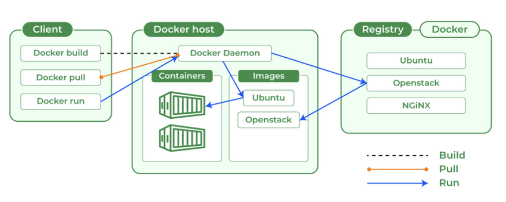

# Getting Started with Docker

Docker is an open-source platform that automates the deployment, scaling, and management of applications within lightweight, portable containers. It enables developers to package applications with all their dependencies, ensuring that they can run consistently across diferent computing environments.



## Components of Docker

The main components of DOcker are

- Containers
- Images
- Volumes
- Network

### Containers

A Docker container is a lightweight, portable, and executable unit that packages software and
its dependencies in a standardized format. Containers are created from Docker images and
provide a runtime environment that isolates applications from the host system, allowing
them to run consistently across various environments.

#### Docker Container Structure

- **Filesystem**: Each container has its own filesystem that is created from a Docker image. This filesystem is built in layers, inheriting from underlying image

- **Processes**: Containers run processes in their own isolated space, separated from host and other containers.

- **Networking**: Containers can communicate with each other and the host thorugh defined network configurations.

#### Create and Running Containers

To create and run a container you use the docker command

```bash
$ docker run [FLAGS] [OPTIONS] IMAGE_NAME
```

Review the Docker official documentation about the docker cli command

[Docker CheatSheet](https://docs.docker.com/get-started/docker_cheatsheet.pdf)

#### Managing Containers

- List Containers: `docker ps -a`
- Stop a Container: `docker stop CONTAINER_NAME`
- Remove a Container: `docker rm CONTAINER_NAME`
- Viewing Logs: `docker logs CONTAINER_NAME`

#### Use Cases:

- **Microservices**: Each microservice can be deployed in its own container, allowing for
  independent scaling and management
- **Development Environments**: Developers can run containers that mimic production
  environments, reducing discrepancies and bugs.
- **Testing**: Containers provide a clean and consistent environment for testing applications.

### Docker Images

Docker images are lightweight, standalone, and executable packages that contain everything needed to run a piece of software, including the code, runtime, libraries, environment variables, and configuration files.

#### Key Features

- **Layered Architecture**: Docker images are built in layers, with each layer representing a
  set of file changes. This allows for ecient storage and sharing, as common layers can be
  reused among dierent images.

- **Portability**: Images can be easily shared and run on any machine that has Docker
  installed, ensuring consistent behavior across dierent environments.

- **Versioning**: Each image can have multiple versions (tags), allowing you to manage and
  deploy specific versions of your applications easily

- **Immutable**: Once an image is built, it does not change. If you need to make changes, you
  create a new image. This immutability helps in maintaining consistency.

- **Base Images**: You can create images from existing base images (like ubuntu, alpine, or
  node), which provide a foundation for building your own applications.

#### Managing Images

- Build Image: `docker build -t [IMAGE_NAME] .`
- List Images: `docker image -a`
- Remove a Image: `docker rmi [IMAGE_NAME]`
- Tagging Images: `docker tag IMAGE_NAME IMAGE_NEW_NAME:TAG`

### Docker Volumes

A Docker volume is a persistent storage mechanism that allows you to store data
outside of your Docker containers. Volumes are managed by Docker and can be shared
among multiple containers, which makes them ideal for scenarios where you need to
preserve data even if a container is stopped or deleted.

#### Key Features

- **Persistence**: Data in a volume remains even if the container using it is removed. This is crucial for database storage, user uploads, and other data that needs to persist.

- **Isolation**: Volumes provide a way to isolate the storage from the container filesystem, which can simplify backups and data management.

- **Sharing**: Multiple containers can access the same volume, allowing for easy data sharing and collaboration between containers.

- **Performance**: Volumes are designed for high performance and can be optimized for diferent storage backends.

- **Management**: Docker provides commands to easily create, inspect, and manage volumes.

#### Create a Volume and attached to a Container

```bash
$ docker run -v /[VOLUME_NAME] [CONTAINER_NAME]
```

Also a host folder can be mapped into a container volume to share data.

#### Note About Docker Volumes

Keep in mind the use of volumes affect the ephemeral nature of containers. If you need a volume to some sort of data persistence, the best practice is to use some form of external storage like NFS, or NAS, etc.

As best practice, try to design your services in a way they are ephemeral, and you can destroy and recreate them quickly.

### Docker Networks

Docker networks allow containers to communicate with each other and with external
systems.

#### Type of Docker Networks

1. **Bridge Network**

   - Default network type.
   - Containers can communicate with each other within the same bridge.
   - Use case: Running multiple containers on the same host.

2. **Host Network**

   - Containers share the host’s network stack.
   - No network isolation between the host and containers.
   - Use case: High-performance applications needing low latency

3. **Overlay Network**

   - Used in Docker Swarm mode.
   - Allows containers on dierent hosts to communicate.
   - Use case: Multi-host applications requiring service discovery.

4. **Macvlan Network**

   - Assigns a MAC address to a container, making it appear as a physical device on the
     network.
   - Use case: Legacy applications needing direct access to the network.

5. **None Network**

   - Disables all networking for the container.
   - Use case: For applications that do not require network access
