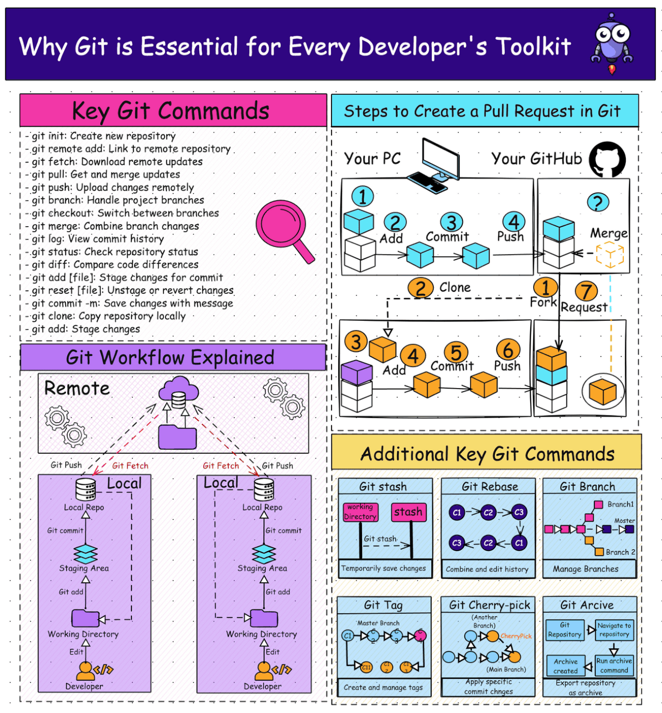

# Getting Started with Git

When you’re working on a file or a document, it is important to save frequently in order to make sure you don’t lose your work.

But code is complicated. The development of code is not linear — often edits are exploratory and end up being reverted. You find quickly that what you want to be able to save and explore is not the actual state of your files, but the sequence of edits you’ve made.

_**git**_ saves your project as a sequence of edits to your code base rather than a set of file contents.

## Git Benefits

- Ensure that you don’t lose what you’ve done.
- Compile and run your code as a sanity check.
- Mark a checkpoint in your progress — a version of your code to backup and come back to if things break.

## Git Workflow

The git workflow will use a common set of commands very often, so this is a summary:

- `git init` : Create a Git Version Control Repo
- `git status`: Check the changes in the folder
- `git add`: Staging a File
- `git commit`: Make your changes (semi)permanent.
- `git pull/git fetch`: receive updates
- `git push`: Send changes to a remote Repo
- `git branch/git checkout`: Manage branches and versions
- `git merge`: apply changes to main codebase.

That's All!
